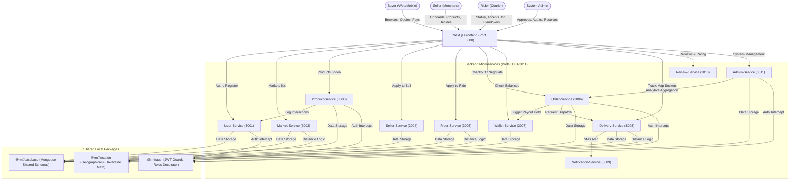

# Rwanda Market Facilitator (RMF) — Technical Architecture Analysis

This architectural report provides an exhaustive, end-to-end breakdown of the RMF (Rwandan Market Facilitator) platform. It maps out the code organization, service relationships, database layers, system topology, security configurations, and business workflows to serve as a comprehensive reference guide for engineering and operational planning.

---

## 1. Product Identity & Design Philosophy

The Rwandan Market Facilitator (RMF) is a localized digital commerce engine designed to bring physical market hubs (such as Nyabugogo, Kimironko, and individual brick-and-mortar storefronts) into a unified ordering, payment, negotiation, delivery, and governance system.

### Core Objectives
* **Local Commerce Digitization:** Enabling physical stalls and independent vendors to be searchable and purchasable online.
* **Escrow-Like Payment Stages:** Building trust with buyers by withholding payments until rider pickup/delivery confirmation events occur.
* **Accountable Logistics Dispatch:** Employing local geographical dispatching that progressively scans for riders, with distance-based dynamic pricing rules.
* **Immersive Visual Discovery:** TikTok-style snap-scroll video feeds for product and shop advertisements to mirror physical marketplace energy.
* **Rigorous Catalog Taxonomy:** Structured, multi-tier product cataloging with variant-level tracking (price, stock, media) rather than simple metadata tags.

---

## 2. Monorepo Structure & System Topology

The RMF codebase is managed inside a **Turborepo Javascript/TypeScript monorepo**. This structure facilitates maximum code reusability while ensuring domain logic isolation.

```
Rwanda-online-shop/
├── apps/                    # Service Sub-Applications
│   ├── admin-service/       # Platform analytics, fraud, auditing, support ticketing
│   ├── delivery-service/    # Distance pricing, rider assignment, tracking sockets, handovers
│   ├── frontend/            # Next.js App Router UI for all 4 user portals
│   ├── market-service/      # Public/individual markets, agreement contracts, operating rules
│   ├── notification-service/# Multi-channel notifications (In-App, SMS, Email)
│   ├── order-service/       # Orders, quote negotiation engine, payment callback, disputes
│   ├── product-service/     # Catalog category trees, products, variants, recommendations, video feeds
│   ├── review-service/      # Tri-directional reviews (Products, Sellers, Markets)
│   ├── rider-service/       # Rider profiles, background/verification approvals, change logs
│   ├── seller-service/      # Seller profiles, onboarding compliance, stall QR codes
│   ├── user-service/        # Auth registry, preferences, user data, recommendation signals
│   └── wallet-service/      # Ledgers, balances, payment allocations, Momo payout triggers
├── packages/                # Shared Packages
│   ├── auth/                # JWT strategy, Roles decorations, Guards, middleware
│   ├── database/            # Shared MongoDB Mongoose models and schema definitions
│   ├── health-check/        # Unified service diagnostic helper utilities
│   ├── location/            # Geographic coordinates, haversine metrics, rider lookup math
│   ├── shared-types/        # Shared enums, types, response mappings
│   └── shared-utils/        # Centralized logger, string formats, error handling wrappers
```

### Topology & Ports Table

| Component Name | Type | Port | Major Responsibilities & Integrations |
| :--- | :--- | :---: | :--- |
| **`apps/frontend`** | Next.js Frontend | `3000` | Buyer shopping interface, dashboards, portals for Sellers, Riders, and Admins |
| **`apps/user-service`** | NestJS Service | `3001` | Auth, logins, user metadata, discovery preferences, wishlists, profiling |
| **`apps/market-service`** | NestJS Service | `3002` | Markets directory, opening status, location metrics, merchant agreements |
| **`apps/product-service`** | NestJS Service | `3003` | Product listings, variants, categories tree, recommendations engine, videos |
| **`apps/seller-service`** | NestJS Service | `3004` | Seller onboarding compliance, stall QR codes, setting change requests |
| **`apps/rider-service`** | NestJS Service | `3005` | Rider profiles, location updates, settings change approvals |
| **`apps/order-service`** | NestJS Service | `3006` | Purchase orders, quote negotiation chat, payment gateway callbacks, disputes |
| **`apps/wallet-service`** | NestJS Service | `3007` | Escrow ledgers, Momo payout hooks, deposit records, platform margins |
| **`apps/delivery-service`** | NestJS Service | `3008` | Dispatching algorithm, progressive radius increases, tracking sockets, handovers |
| **`apps/notification-service`**| NestJS Service | `3009` | SMS (Africa's Talking), Email (SendGrid), push-alerts log tracking |
| **`apps/review-service`** | NestJS Service | `3010` | 5-star rating logs and comments for items, sellers, and markets |
| **`apps/admin-service`** | NestJS Service | `3011` | Analytics, support ticketers, accounting indexes, fraud alerts dispatcher |

---

## 3. High-Level System Relationship Diagram

The following Mermaid diagram visualizes the interactive relationships between the four primary user personas, the Next.js Frontend, the 11 Backend microservices, and the shared Database/Location packages.



---

## 4. Shared Database Schema Architecture

Database access in RMF is centralized via the `@rmf/database` local package. Rather than microservices having completely disconnected data stores (which is hard to orchestrate in a small team), this system shares a unified MongoDB server while enforcing strict logical constraints per service.

Here is a breakdown of the 21 database schemas exported by `@rmf/database`:

### 1. `User` Schema
* **Role:** Stores credentials, profile data, roles (`BUYER`, `SELLER`, `RIDER`, `ADMIN`), and recommendation affinity flags.
* **Key Fields:** `email`, `passwordHash`, `role`, `isVerified`, `wishlist[]`, `discoveryPreferences: { categories[], markets[] }`, `interactionSignals: { categoryViews{}, productViews{} }`.

### 2. `Market` Schema
* **Role:** Represents physical markets or independent trade zones.
* **Key Fields:** `name`, `slug`, `locationType` (`public` or `individual`), `district`, `coordinates: { lat, lng }`, `images[]`, `operatingHours: { open, close }`, `status` (`active`, `suspended`), `counters: { sellerCount, productCount }`.

### 3. `SellerProfile` Schema
* **Role:** Links a User with a physical marketplace presence.
* **Key Fields:** `userId`, `marketId`, `shopName`, `stallCode`, `status` (`pending`, `approved`, `suspended`), `momoPayoutNumber`, `documents[]: { type, url }`, `onboardedAt`.

### 4. `RiderProfile` Schema
* **Role:** Courier profile managing logistics credentials and live geolocation coordinates.
* **Key Fields:** `userId`, `vehicleType` (`moto`, `bicycle`, `car`), `plateNumber`, `status` (`pending`, `approved`, `suspended`), `liveLocation: { type: "Point", coordinates: [lng, lat] }`, `lastActiveAt`, `momoPayoutNumber`.

### 5. `Product` Schema
* **Role:** Parent catalog definitions for purchasable goods.
* **Key Fields:** `name`, `description`, `sellerId`, `marketId`, `categoryTree[]` (`[Parent, Child, Grandchild]`), `attributes: Map<string, string>`, `variants[]` (inline schemas), `isMadeInRwanda`, `isNegotiable`, `approvalStatus` (`pending`, `approved`, `rejected`), `images[]`, `videoUrl`.

### 6. `TaxonomyCategory` Schema
* **Role:** Governs the marketplace category tree dynamically.
* **Key Fields:** `name`, `parentId` (self-reference), `slug`, `isActive`, `requiredAttributes[]: { name, type, options[] }`, `variantAxes[]` (e.g., `size`, `color`, `material`).

### 7. `Transaction` Schema (Order)
* **Role:** Financial and operational log for cart actions, quote negotiations, and payment confirmations.
* **Key Fields:** `orderId`, `buyerId`, `sellerId`, `marketId`, `items[]: { productId, variantId, name, quantity, priceSnapshot }`, `subtotal`, `deliveryFee`, `total`, `orderStatus` (enum), `paymentStatus` (enum), `paymentRef`, `quoteNegotiation: { currentOffer, chat[]: { sender, text, fileUrl, sentAt } }`, `dispute: { status, reason, resolution, handlerId }`.

### 8. `Delivery` Schema
* **Role:** Live dispatch state tracking.
* **Key Fields:** `orderId`, `riderId`, `status` (assigned, picked_up, delivered, failed), `pickupLocation: { lat, lng }`, `dropoffLocation: { lat, lng }`, `fee`, `pickupProofUrl`, `handoverQR`, `trackingTimeline[]: { status, timestamp, lat, lng }`.

### 9. `Wallet` Schema
* **Role:** Escrow balances and payout values.
* **Key Fields:** `userId`, `balance` (ledger backed), `escrowBalance` (funds held until handover), `currency` (`RWF`), `updatedAt`.

### 10. `LedgerEntry` Schema
* **Role:** Immutable accounting ledger entries.
* **Key Fields:** `walletId`, `amount`, `type` (`credit`, `debit`), `referenceType` (`order`, `payout`, `refund`, `deposit`), `referenceId`, `description`, `timestamp`.

### 11. `PayoutRequest` Schema
* **Role:** Queue for merchants/riders withdrawing funds to MTN MoMo or Airtel Money.
* **Key Fields:** `userId`, `amount`, `channel` (`momo_mtn`, `momo_airtel`), `payoutNumber`, `status` (`pending`, `processing`, `completed`, `failed`), `failureReason`, `adminActorId`.

### 12. `Promotion` Schema
* **Role:** Active vendor discount parameters.
* **Key Fields:** `sellerId`, `productId`, `promoType` (`percentage`, `fixed_amount`), `value`, `startDate`, `endDate`, `isActive`.

### 13. `SellerVideo` Schema
* **Role:** Reels and short video advertisements for physical markets and items.
* **Key Fields:** `sellerId`, `productId`, `videoUrl`, `thumbnailUrl`, `videoType` (`product_ad`, `shop_ad`, `market_ad`), `caption`, `reactions: { likes[], dislikes[] }`, `comments[]: { userId, text, createdAt }`.

### 14. `Review` Schema
* **Role:** Multi-target reviews.
* **Key Fields:** `buyerId`, `targetType` (`product`, `seller`, `market`), `targetId`, `rating` (1 to 5), `comment`, `createdAt`.

### 15. `NotificationLog` Schema
* **Role:** Dispatch history for system messages.
* **Key Fields:** `userId`, `channels: { inApp: boolean, sms: boolean, email: boolean }`, `title`, `body`, `isRead`, `createdAt`.

### 16. `SupportTicket` Schema
* **Role:** Customer help requests.
* **Key Fields:** `buyerId` | `sellerId` | `riderId`, `subject`, `description`, `status` (`open`, `in_progress`, `resolved`), `chat[]`, `createdAt`.

### 17. `AuditLog` Schema
* **Role:** Write-once log files for structural actions.
* **Key Fields:** `actorId`, `actionType` (auth, delete_product, approve_seller), `metadata: Map<string, string>`, `ipAddress`, `timestamp`.

### 18. `ProfileChangeRequest` Schema
* **Role:** Intercept schema for sensitive user profile modifications awaiting Admin approval.
* **Key Fields:** `userId`, `role` (`SELLER` | `RIDER`), `requestedChanges: Map<string, any>`, `status` (`pending`, `approved`, `rejected`), `adminReviewerId`.

### 19. `RiderRejection` Schema
* **Role:** Tracks riders who decline delivery broadcasts.
* **Key Fields:** `riderId`, `deliveryId`, `reason`, `timestamp`.

### 20. `Contract` Schema
* **Role:** Stores legal structures/fees agreed to during Seller/Rider onboarding.
* **Key Fields:** `version`, `title`, `content`, `isActive`, `createdAt`.

### 21. `Location` Schema
* **Role:** Simple spatial polygon and point lookups for delivery zone coverage.
* **Key Fields:** `name`, `type` (`Point` | `Polygon`), `coordinates`.

---

## 5. Key Business Workflows

RMF operates distinct, non-generic workflows built specifically for trust, local coordination, and high-fidelity catalogs.

### Workflow A: Buyer Proximity & Interests Recommendation
```
[Buyer registers / preferences] ──> [Saved by User-Service] 
                                            │
  ┌─────────────────────────────────────────┘
  ▼
[Loads Marketplace Gateway (/)]
  ├── 1. Geolocation active:
  │      ├── Gets User coordinates.
  │      └── Market-Service matches closest physical markets first using Haversine math.
  └── 2. Product-Service `/recommendations/for-me`:
         ├── Fetches Category affinity & Wishlist items from User-Service.
         ├── Merges with trending and "Made in Rwanda" flags.
         └── Renders targeted rails (Fashion, Crafts, Fresh Produce, Auto Parts).
```

### Workflow B: Multi-Tier Catalog & Variant Schema
To avoid unstructured metadata, products in RMF map to a precise three-tier hierarchy:
`Parent Category` (e.g., *Home and Building*) ──> `Child Category` (e.g., *Building Materials*) ──> `Grandchild Category` (e.g., *Portland Cement*).

* **Drilldown Picker:** The seller is forced to select the grandchild layer in `/seller/products/new`.
* **Category Schema Enforcement:** Selecting the grandchild dynamically fetches its `requiredAttributes` and `variantAxes` defined in `TaxonomyCategory`.
* **Variant Structuring:** Sellers define specific options (e.g., *Variant 1: 50kg Bag - 14,000 RWF*, *Variant 2: 25kg Bag - 7,500 RWF*), each tracking its own SKU, price, and stock levels. Add-to-cart operations record the exact variant snapshot so sellers and riders execute orders cleanly.

### Workflow C: Quote Negotiation Engine
When a product is marked `isNegotiable = true`, buyers can negotiate price quotes before committing to payment.

```
Buyer clicks "Negotiate"
  │
  ▼
Order starts as 'awaiting_quote' (No payment allowed yet)
  │
  ├─> Chat UI opens on Order Detail Page
  ├─> Buyer sends message & offer price
  │
  ▼
Seller dashboard receives Request
  │
  ├─> Counter-offers? -> Stays 'awaiting_quote'
  ├─> Reject? -> Moves to 'cancelled'
  ├─> Accept Offer? -> Moves to 'placed' (Order is locked)
  │
  ▼
Buyer processes payment via MoMo Callback (MTN/Airtel)
  │
  ▼
Order moves to 'confirmed' (Funds sent to Escrow Ledger)
  │
  ▼
Seller prepares items -> 'ready_for_pickup' (Triggers Delivery Dispatch)
```

### Workflow D: Progressive Radius Logistics Dispatcher
RMF dispatch logic prevents riders from traveling unnecessarily far while ensuring no order is stuck.

```
Order marked 'ready_for_pickup'
  │
  ▼
Delivery-Service queries Rider Geolocation database
  │
  ├─> Step 1: Scan for approved, online riders within 150 meters
  │      ├── Rider found? Broadcast Job Card.
  │      └── Accepted? -> Assign Rider and lock job.
  │
  ▼ (Timeout - 45s / No acceptance)
  │
  ├─> Step 2: Expand search radius by 50 meters
  │      └── Add 500 RWF progressively to the delivery fee (Distance Pricing rule)
  │
  ▼ (Repeat expansion to outer limits: max 16 km)
  │
  └─> Job accepted -> Rider heads to market stall.
```

* **Escrow Handover Trust:**
  1. Rider arrives at merchant shop. Handover verified via **Pickup Photo upload + Merchant confirmation**. Seller payout is partially released to prevent cash-flow lock.
  2. Rider arrives at buyer. Handover verified via **QR code scan + Buyer confirmation**. Rider payout and remaining seller balance are finalized and unlocked.

---

## 6. Security, Roles & Authorization Audit

A strict verification boundary surrounds all RMF platform endpoints to protect against malicious mutations and IDOR (Insecure Direct Object Reference) exploits.

### Role Definitions (`UserRole` Enum)
1. **`BUYER`:** Allowed public browsing, wishlist management, cart operations, quote negotiation, payment actions, and order/delivery tracking.
2. **`SELLER`:** Accesses seller dashboards, product/variant management (own items only), order fulfillment, quote approvals, earnings withdrawal requests, stall QR generation, and video ad uploads.
3. **`RIDER`:** Status management (on/off duty), job scanning, delivery tracking inputs, handover QR scans, and withdrawal requests.
4. **`ADMIN`:** Full read/write operational dashboard control, fraud mitigation triggers, dispute adjudications, seller/rider manual compliance reviews, and financial payout authorizations.

### Authentication Guards & Middlewares
* **`JwtAuthGuard`:** Validates incoming Bearer JWT tokens in request headers.
* **`Roles(UserRole.X)`:** Custom NestJS decorator enforcing that the authenticated actor belongs to authorized role groups.
* **`OptionalJwtAuthGuard`:** Allows public reading (such as `/products` or recommendations) while enriching recommendations if a logged-in user context is detected.
* **`INTERNAL_SERVICE_SECRET` (`x-internal-service-key`):** Secures inter-service communications (e.g., when the Order-Service notifies the Product-Service to increment popular counts) by bypassing public JWT controls while locking down raw network queries.

> [!IMPORTANT]
> **Defensive Ownership Coding (Anti-IDOR):**
> Every data mutation endpoint (such as product updates, stock alterations, and bulk uploads) executes an IDOR verification step. If the actor's role is `SELLER`, the controller queries the database to prove the product's `sellerId` matches the authenticated user's `sellerProfile._id`. Only `ADMIN` role actors are granted system-wide overrides.

---

## 7. Frontend Pages Routing Matrix

The frontend application (`apps/frontend`) is a Next.js App Router application providing specialized dashboards and portals using an orange trust-focused design language.

### Public & Buyer Routes
* **`/`** (Marketplace Home): Displays global search, geographical selector, active markets directory, recommended products, Made in Rwanda showcases, and trending reels.
* **`/markets`** (Markets Map): Side-by-side geographic map layout (using `@rmf/location`) and grid of active markets, sortable by proximity.
* **`/market/[slug]`** (Physical Storefront): Showcases stall location coordinates, active sellers, promoted items, market video loops, and verified merchant badges.
* **`/market/[slug]/product/[productId]`** (Item Page): Full gallery, variant dropdown selectors, category attribute matrices, wishlist actions, checkout options, and "Negotiate" triggers.
* **`/videos`** (TikTok Feed): Vertical snap-scroll feed for seller Reels with instant add-to-cart hooks.
* **`/preferences`** (Pinterest Board): Multi-grid selection screen where newly registered buyers toggle liked categories/markets to populate recommendation maps.
* **`/cart`** & **`/checkout`**: Item variant listings, MTN/Airtel money transaction cards, delivery progressive fee explanations, and secure checkout portals.
* **`/orders/[id]/tracking`**: Live map tracking (WebSockets), timeline, transaction receipt download, secure delivery dispute launcher, and QR validation panels.

### Seller Portal Routes
* **`/seller/onboarding`**: Stall registration forms, legal contract agreement signature, and merchant verification document uploads (reviewed by admins).
* **`/seller/dashboard`**: Main operations console containing sales metrics, wallet ledgers, and order pipeline sockets.
* **`/seller/products`** & **`/seller/products/new`**: Inventory matrices, category attribute builders, and drag-and-drop file uploaders for bulk CSV/XLSX imports.
* **`/seller/orders/[orderId]`**: Fulfillment control dashboard featuring item snapshots, client dossiers, quote negotiation chat, and pickup validations.
* **`/seller/videos`** & **`/seller/earnings`**: Reel media publishers and MoMo transfer tools.

### Rider Portal Routes
* **`/rider/dashboard`**: Interactive maps highlighting available jobs, status indicators, and tracking controls.
* **`/rider/deliveries`** & **`/rider/earnings`**: Historic couriers registries and withdrawal panels.

### Admin Governance Portal (`/admin`)
The system administrator dashboard uses an optimized, highly dense tabbed structure to monitor the marketplace:
* **Analytics Tab:** GMV tracking graphs, transaction counts, platform revenue, and user registries.
* **Accounting Tab:** Platform fees ledger, refund balances, escrow trackers, and net bank holdings.
* **Live Operations Tab:** Live Leaflet/Google Map displaying real-time coordinates of active riders and pending pick-up jobs.
* **Approvals Tabs (Seller/Rider/Product):** Compliance checklists, PDF business registry review modules, and one-click accept/decline tools.
* **Taxonomy Tab:** Tree builder for product hierarchies (Category -> Attributes -> Variant Axes) and migration tools.
* **Disputes & Fraud Alerts Tab:** Automated alarms highlighting distance discrepancies, courier stalling events, and open dispute tickets.
* **Support Ticket Tab:** Full-scale helpdesk ticker inbox.

---

## 8. Summary of Technical Analysis Findings

RMF is a robustly engineered monorepo that avoids common architectural traps by consolidating schemas inside `@rmf/database` and sharing geolocation calculators via `@rmf/location`, while maintaining completely segregated NestJS microservices to limit runtime side effects. 

The security boundaries are tight, incorporating defensive check strategies to eliminate unauthorized access and IDOR exploits. The business processes are custom-built around trust-building local mechanisms (escrow handovers, distance-based courier dispatch, and multi-tier variant listings), laying a solid foundation for physical-to-digital marketplace commerce.
